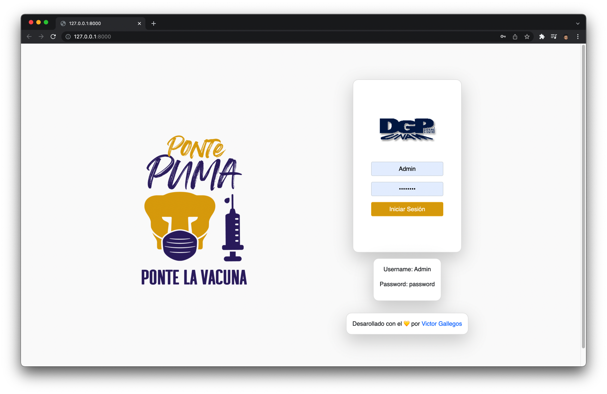

# Registro de Empleados UNAM 💛

## *Desarrollado por <a href="https://github.com/VictorDeGallegos">Victor Hugo Gallegos Mota</a>   y <a class="text-decoration-none" href="https://github.com/CarlosCruzRangel">Carlos Cruz Rangel </a>*
<h2>App que simula el registro de usuarios de la UNAM desarrollada en Django </h2>

<ul>
<li>Este es un sitio web de registro de empleados, que muestra todos los empleados registrados.</li>
<li>Un administrador puede registrar un nuevo empleado con los formularios de Django</li>
<li>Los detalles de un empleado se pueden actualizar, así como se eliminan.</li>
<li>Se puede buscar un empleado por su CURP</li>
  </ul>

<h2>Requisitos 📄</h2> 

<ul>
  <li>Python3</li>
  <li>Django4</li></ul>

<h2>Ejecutar la aplicación 🚀</h2>

Ejecute este comando para instalar lo requerimientos necesarios del programa <pre><code>pip install -r requeriments.txt</code></pre> Despues ejecuta las siguientes migraciones <pre><code>Python3 manage.py makemigrations</code></pre> <pre><code>Python3 manage.py migrate</code></pre>  Y por ultimo  iniciar el servidor Backend en el directorio [Backend]: <pre><code>[Python3 manage.py runserver]</code></pre>  (Tienes que ejecutar este comando mientras se encuentra en el entorno virtual "newenv")

<h2>Construido con 🔨</h2>

<ul>
  <li><a href="https://www.python.org/">Python</a> - Un lenguaje de programación que le permite trabajar rápidamente e integrar sistemas de manera más efectiva..</li>
  <li><a href="https://www.djangoproject.com/">Django</a> - Un Framework de Python de alto nivel que fomenta el desarrollo rápido y el diseño pragmático y limpio.</li>
</ul>

  <h2>Capturas de pantalla de la app en ejecución: 📸</h2>

