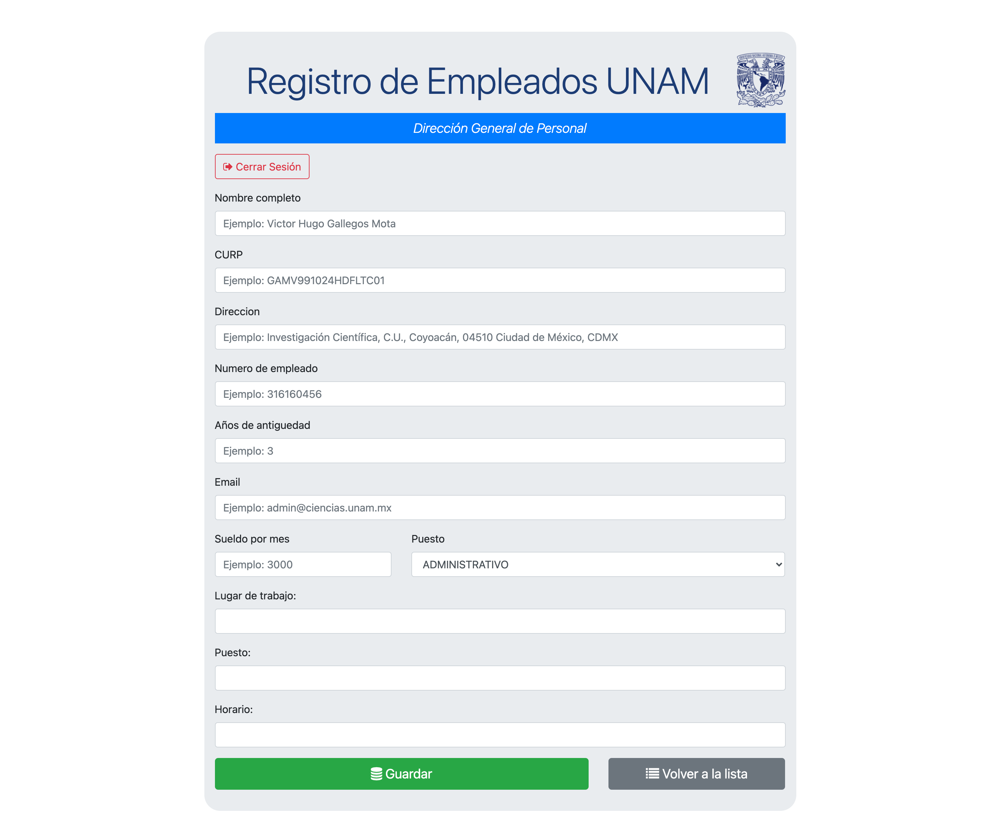

# Registro de Empleados UNAM
<h2>App que simula el registro de usuarios de la UNAM desarrollada en Django </h2>

<ul>
<li>Este es un sitio web de registro de empleados, que muestra todos los empleados registrados.</li>
<li>Un administrador puede registrar un nuevo empleado con los formularios de Django</li>
<li>Los detalles de un empleado se pueden actualizar, así como se eliminan.</li>
<li>Se puede buscar un empleado por su CURP</li>
  </ul>

<h2>Requisitos</h2>

<ul>
  <li>Python3</li>
  <li>Django4</li></ul>

<h2>Ejecutar la aplicación</h2>

Ejecute este comando para iniciar el servidor Backend en el directorio [Backend]: [python3 manage.py runserver] (Tienes que ejecutar este comando mientras se encuentra en el entorno virtual)

<h2>Construido con</h2>

<ul>
  <li><a href="https://www.python.org/">Python</a> - Un lenguaje de programación que le permite trabajar rápidamente e integrar sistemas de manera más efectiva..</li>
  <li><a href="https://www.djangoproject.com/">Django</a> - Un Framework de Python de alto nivel que fomenta el desarrollo rápido y el diseño pragmático y limpio.</li>
</ul>

  <h2>Capturas de pantalla de la app en ejecución:</h2>

